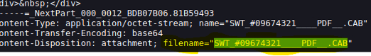
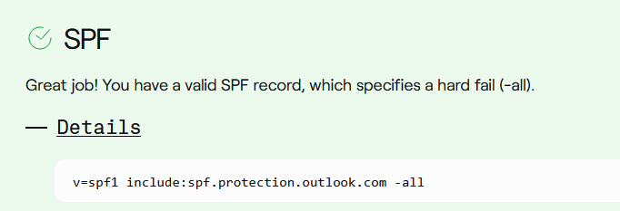
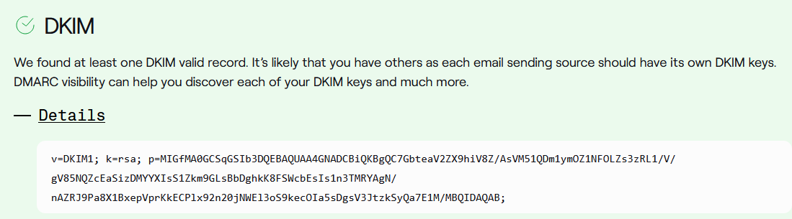
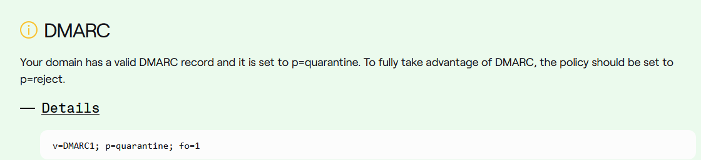
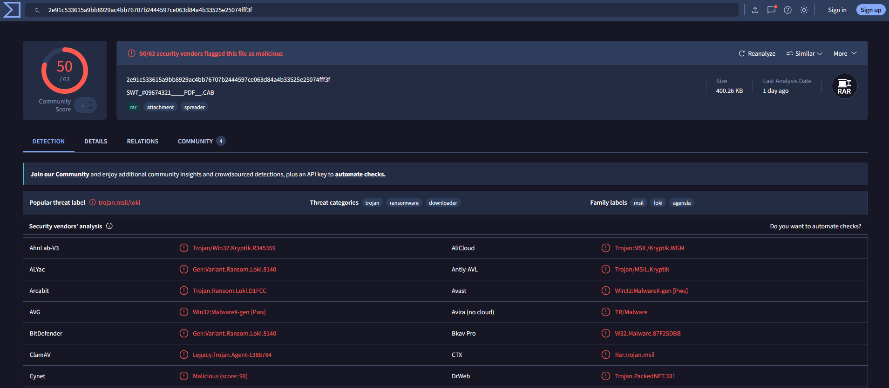

# Greenholt Phish Investigation

## Overview

This repository documents the analysis of a suspected phishing email using standard Security Operations Center (SOC) investigation techniques. The investigation focuses on email header analysis, sender authentication validation (SPF, DKIM, and DMARC), indicator of compromise (IOC) extraction, attachment analysis, and threat intelligence research to determine whether the email represents a phishing attempt.

---

## Disclaimer

This investigation was completed using a simulated phishing sample provided in a controlled cybersecurity training environment. The scenario is based on a TryHackMe lab, while the analysis, documentation, screenshots, and reporting included in this repository reflect my own investigation process and demonstrate SOC analyst methodologies rather than a real-world incident.

---

## Scenario

A Greenholt PLC employee reported a suspicious email that appeared to originate from a known customer. The message contained an unexpected financial transfer request, a generic greeting, and an unsolicited attachment. Due to multiple phishing indicators, the email was escalated to the Security Operations Center (SOC) for investigation.

---

## Investigation Objectives

- Analyze email metadata and message headers
- Validate sender authenticity using SPF, DKIM, and DMARC
- Extract and document Indicators of Compromise (IOCs)
- Analyze the suspicious attachment
- Perform threat intelligence research
- Determine the likely attack type
- Document findings and recommended SOC response actions

---

## Investigation Methodology

The investigation followed a standard SOC phishing analysis workflow:

1. Initial email triage
2. Email header analysis
3. Sender authentication validation
4. IOC extraction
5. Threat intelligence research
6. Attachment analysis
7. Attack classification
8. Documentation of findings

---

## Tools and Technologies

- Email Header Analysis
- VirusTotal
- SPF Record Lookup
- DKIM Analysis
- DMARC Analysis
- SHA256 Hashing
- Threat Intelligence Research
- MITRE ATT&CK Framework

---

## Investigation Outcome

The investigation identified multiple indicators consistent with a phishing campaign, including:

- Suspicious financial transfer request
- Reply-To address inconsistency
- Suspicious compressed attachment disguised as a PDF
- IOC extraction and reputation analysis
- Attachment hash verification using VirusTotal

Based on the collected evidence, the email was assessed as a suspected phishing attempt involving social engineering and potential malicious attachment delivery.

---

## MITRE ATT&CK Mapping

| Technique | Description |
|-----------|-------------|
| T1566 | Phishing |
| T1204 | User Execution |

---

## Repository Contents

```
Greenholt-Phish-Analysis/
│
├── README.md
├── Investigation-Report.md
├── IOC-List.md
└── screenshots/
    ├── MIME-attachment-header.png
    ├── dkim-analysis.png
    ├── spf-analysis.png
    ├── dmarc-analysis.png
    └── virustotal-results.png
```

---

# Investigation Screenshots

### Figure 1. MIME Attachment Header



The MIME headers identified an attached file named `SWT_#09674321___PDF__.CAB`. The attachment was encoded using Base64 and delivered as a generic binary (`application/octet-stream`). Although the filename suggests a PDF document, the `.CAB` extension is unusual for an invoice or payment request and warranted further analysis.

---

### Figure 2. SPF Record Analysis



The sender domain publishes the following SPF record:

`v=spf1 include:spf.protection.outlook.com -all`

This SPF policy authorizes Microsoft 365 (`spf.protection.outlook.com`) as an approved email sending service for the domain. While the domain has a valid SPF record configured, SPF alone does not confirm that an email is legitimate. The result should be evaluated alongside the email headers, Reply-To address, DKIM, and DMARC during sender authentication analysis.

---

### Figure 3. DKIM Analysis



DKIM analysis was performed to determine whether the sender's domain digitally signs outbound email. DKIM helps verify that message contents have not been altered during transmission and serves as one component of email authentication when combined with SPF and DMARC.

---

### Figure 4. DMARC Policy Analysis



The sender domain publishes the following DMARC policy:

`v=DMARC1; p=quarantine; fo=1`

This policy instructs receiving mail servers to quarantine messages that fail DMARC validation. Reviewing DMARC policies helps analysts evaluate how a domain protects against email spoofing and complements SPF and DKIM validation.

---

### Figure 5. VirusTotal Attachment Analysis



The attachment's SHA256 hash was investigated using VirusTotal as part of the threat intelligence process. Reputation analysis identified the attachment as a compressed archive despite its PDF-themed filename. Hash reputation lookups provide additional context when determining whether an attachment has previously been associated with malicious activity.

---

## Skills Demonstrated

- Phishing Email Analysis
- Email Header Analysis
- MIME Header Analysis
- Email Authentication (SPF, DKIM, and DMARC)
- IOC Identification and Documentation
- Threat Intelligence Research
- VirusTotal Analysis
- Attachment Analysis
- SHA256 Hash Verification
- MITRE ATT&CK Mapping
- Security Documentation
- SOC Investigation Workflow

---

## Author

**Stacey Menley**

Bachelor of Applied Science – Information Technology (Cybersecurity)

CompTIA Security+ | Network+ | ISC² Certified in Cybersecurity (CC)
